<p align="center">
	
</p>

# 🌟 Welcome to FastSitePHP!

**Thanks for visiting!** 🌠👍

<table>
	<tbody>
		<tr align="center"><td colspan="2">
<g-emoji class="g-emoji" alias="globe_with_meridians" fallback-src="https://github.githubassets.com/images/icons/emoji/unicode/1f310.png"></g-emoji> <g-emoji class="g-emoji" alias="earth_americas" fallback-src="https://github.githubassets.com/images/icons/emoji/unicode/1f30e.png"></g-emoji> <g-emoji class="g-emoji" alias="earth_asia" fallback-src="https://github.githubassets.com/images/icons/emoji/unicode/1f30f.png"></g-emoji> <g-emoji class="g-emoji" alias="earth_africa" fallback-src="https://github.githubassets.com/images/icons/emoji/unicode/1f30d.png"></g-emoji>
		</td></tr>
		<tr>
			<td><a href="https://github.com/fastsitephp/fastsitephp/blob/master/docs/i18n-readme/README.es.md">Español</a>
			</td>
			<td><a href="https://github.com/fastsitephp/fastsitephp/blob/master/docs/i18n-readme/README.es.md">Bienvenido a FastSitePHP</a></td>
		</tr>
		<tr>
			<td><a href="https://github.com/fastsitephp/fastsitephp/blob/master/docs/i18n-readme/README.pt-BR.md">Português (do Brasil)</a>
			</td>
			<td><a href="https://github.com/fastsitephp/fastsitephp/blob/master/docs/i18n-readme/README.pt-BR.md">Bem vindo ao FastSitePHP</a></td>
		</tr>
	</tbody>
</table>

FastSitePHP is a modern open source Framework for building High Performance websites and API’s with PHP. FastSitePHP has been designed for fast performance, coding flexibility, long term stability, ease of use, and a better overall development experience. FastSitePHP is minimal in size so it quick to download and easy to get started. FastSitePHP was first published in November of 2019, and it was written and used over many years prior to its release. As of 2024 has been used in a variety of applications and websites and is extremely stable and contains many unit tests.

This repository contains FastSitePHP’s Framework and main Website.

FastSitePHP includes many Standalone Components that can be used without using the main Application object or Framework so it’s easy to use FastSitePHP with other PHP Frameworks or Projects.

## 💫 Why use FastSitePHP?

|||
|---|---|
|**Great Performance** With FastSitePHP complex pages can be generated within thousands of a second using only a small amount of memory. This level of performance even allows for sites to run fast on low powered computers.|**Easy to setup and use** FastSitePHP is designed so that it easy to setup to on any OS, easy to read the code, easy to develop with, and much more. With FastSitePHP high quality websites and apps can be developed at a rapid pace using fewer lines of code and minimal config.|

|||
|---|---|
|**Quick to learn and debug** FastSitePHP is well documented and comes with practical samples. FastSitePHP provides developer friendly error messages so that errors can be fixed quickly even if you have little or no experience programming with PHP.|**Strong Security** Security has been carefully planned in all features of FastSitePHP so that it is both secure and easy to work with. Security features include Encryption (text, objects, and files), Signed Cookies, JWT, CORS, Proxy Server Validation, Rate Limiting, and more.|

## 🚀 Try it online!

The main site for FastSitePHP provides a Code Playground where you can develop with PHP, HTML, JavaScript, CSS, and more. There is nothing to install and you can work with PHP directly on a server. If you have never used PHP this is a great way to learn PHP.

[https://www.fastsitephp.com/en/playground](https://www.fastsitephp.com/en/playground)

<p align="center">

</p>

## 🚀 Getting Started

**Getting started with PHP and FastSitePHP is extremely easy.** If you do not have PHP installed then see instructions for Windows, Mac, and Linux on the getting started page:

<a href="https://www.fastsitephp.com/en/getting-started" target="_blank">https://www.fastsitephp.com/en/getting-started</a>

Once PHP is installed you can launch the site from the command-line as show below or if you use a Code Editor or IDE [Visual Studio Code, GitHub Atom, etc] then you can launch the site directly from your editor. See the above getting started page for more.

### Download and run the Main Website and Full Framework (~1.2 mb)

~~~
# Download this Repository
cd {root-directory}
php -S localhost:3000
~~~

To include support for rendering server-side markdown documents or support for crypto functions with older versions of PHP (PHP 5) first run the install script.

~~~
cd {root-directory}
php ./scripts/install.php
~~~

### Install using Composer (PHP Dependency/Package Manager) (~470 kb)

The FastSitePHP Framework can also be installed using Composer. When installed from Composer only the core Framework files are included and not this full Repository with the Main Website. The size of downloaded files is small, so it’s quick to include with existing PHP projects or use to start new projects. FastSitePHP classes can be used with existing Symfony, Laravel, Zend or other PHP Frameworks when using Composer.

~~~
composer require fastsitephp/fastsitephp
~~~

### Start with a Starter Site (~67 kb)

A starter site for FastSitePHP also exists that includes several examples pages and provides a basic directory/file structure. It’s small in size and quick to setup.

[https://github.com/fastsitephp/starter-site](https://github.com/fastsitephp/starter-site)

<p align="center">

</p>

## 📄 Example Code

```php
<?php

// -------------------------------
// Setup
// -------------------------------

// Setup a PHP Autoloader
// This allows classes to be dynamically loaded
require '../../../autoload.php';

// OR for a minimal site only the following 2 files need to be included
// require '../vendor/fastsitephp/src/Application.php';
// require '../vendor/fastsitephp/src/Route.php';

// Create the Application Object with Error Handling and UTC for the Timezone
$app = new \FastSitePHP\Application();
$app->setup('UTC');

// -------------------------------
// Define Routes
// -------------------------------

// Send a response of 'Hello World!' for default requests
$app->get('/', function() {
    return 'Hello World!';
});

// Send a response 'Hello World!' for the URL '/hello' or in the case of the
// optional [name] variable safely escape and return a message with the name
// (example: '/hello/FastSitePHP' will output 'Hello FastSitePHP!')
$app->get('/hello/:name?', function($name = 'World') use ($app) {
    return 'Hello ' . $app->escape($name) . '!';
});

// Send a JSON Response that contains an object with basic Site info
$app->get('/site', function() use ($app) {
    return [
        'rootUrl' => $app->rootUrl(),
        'rootDir' => $app->rootDir(),
        'requestedPath' => $app->requestedPath(),
    ];
});

// Send a JSON Response that contains basic Request info
$app->get('/request', function() {
    $req = new \FastSitePHP\Web\Request();
    return [
        'acceptEncoding' => $req->acceptEncoding(),
        'acceptLanguage' => $req->acceptLanguage(),
        'origin' => $req->origin(),
        'userAgent' => $req->userAgent(),
        'referrer' => $req->referrer(),
        'clientIp' => $req->clientIp(),
        'protocol' => $req->protocol(),
        'host' => $req->host(),
        'port' => $req->port(),
    ];
});

// Send the contents of this file as a plain text response using
// HTTP Response Headers that allow for the end user to cache the  
// page until the file is modified
$app->get('/cached-file', function() {
    $file_path = __FILE__;
    $res = new \FastSitePHP\Web\Response();
    return $res->file($file_path, 'text', 'etag:md5', 'private');
});

// Return the user's IP Address as a JSON Web Service that supports
// Cross-Origin Resource Sharing (CORS) and specifically tells the browser
// to not cache the results. In this example the Web Server is assumed to
// be behind a proxy server (for example a Load Balancer) and the IP Address
// is safely read from it. Additionally the cors() function is called from a
// filter function which only gets called if the route is matched and allows
// for correct handling of an OPTIONS request.
$app->get('/whats-my-ip', function() {
    $req = new \FastSitePHP\Web\Request();
    return [
        'ipAddress' => $req->clientIp('from proxy', 'trust local'),
    ];
})
->filter(function() use ($app) {
    $app
        ->noCache()
        ->cors('*');
});

// Define a function that returns true if the web request is coming
// from a local network (for example 127.0.0.1 or 10.0.0.1). This
// function will be used in a filter to show or hide routes.
$is_local = function() {
    // Compare Request IP using Classless Inter-Domain Routing (CIDR)
    $req = new \FastSitePHP\Web\Request();
    $private_ips = \FastSitePHP\Net\IP::privateNetworkAddresses();

    return \FastSitePHP\Net\IP::cidr(
        $private_ips,
        $req->clientIp('from proxy')
    );
};

// Provide detailed environment info from PHP for users requesting the page
// from a local network. If the request is coming from someone on the internet
// then a 404 Response 'Page not found' would be returned. Calling [phpinfo()]
// outputs an HTML response so the route does not need to return anything.
$app->get('/phpinfo', function() {
    phpinfo();
})
->filter($is_local);

// Provide a Text Response with Server Info for Local Users
$app->get('/server', function() {
    $config = new \FastSitePHP\Net\Config();
    $req = new \FastSitePHP\Web\Request();
    $res = new \FastSitePHP\Web\Response();
    return $res
        ->contentType('text')
        ->content(implode("\n", [
            "Host: {$config->fqdn()}",
            "Server IP: {$req->serverIp()}",
            "Network IP: {$config->networkIp()}",
            str_repeat('-', 80),
            $config->networkInfo(),
        ]));
})
->filter($is_local);

// If the requested url starts with '/examples' then load a PHP file for
// the matching routes from the current directory. This is a real file
// that provides many more examples. If you download this site, this code
// and other examples can be found in [app_data/sample-code].
$app->mount('/examples', 'home-page-en-examples.php');

// -------------------------------
// Run the application
// -------------------------------
$app->run();
```

## 🤝 Contributing

**All contributions are welcome.** For major changes including new classes, breaking changes to existing code, updating existing graphics and files, please open an issue first to discuss what you would like to change. Some examples of items to contribute:

* Additional Translations
* Typos and Grammar Mistakes - If you see any please fix and submit.
* Adding additional demo pages - The demo pages typically use more HTML, CSS, and JavaScript than PHP so if you are a web developer and do not know PHP you can easily learn it during development.
* Additional Unit Tests and Testing Methods
* Additional Documentation and Tutorials
* Additional Classes and Features
* New Ideas - If you have ideas on how to improve then please open an issue to discuss.

The [docs/to-do-list.txt](https://github.com/fastsitephp/fastsitephp/blob/master/docs/to-do-list.txt) file contains the full list of items that are currently pending and is good place to start.

## ❓ FAQ

**Why was FastSitePHP Created?**

The core code for FastSitePHP was started on in 2013 when the lead author was developing a website using PHP. Originally popular PHP Frameworks were compared, tested, and one was initially chosen. However at the time (<a href="https://www.techempower.com/benchmarks/" target="_blank">and still now for the most part</a>) most PHP frameworks were extremely slow compared to frameworks in other languages and the PHP language itself.

For the site being developed the framework and components were replaced one by one into separate classes and once all third-party frameworks and classes were removed the site performed 60x faster, used 10x less memory, achieved 100 score on Google speed test, and unexpected server errors went away. Then over a 6-year period the core code was developed into FastSitePHP.

**I already know JavaScript/Node, Python, C#, Java, etc. Why should I learn PHP?**

* PHP is the most widely used programming language in the world for dynamic server-side websites; this includes many of the most popular websites in the world.
* PHP has great documentation and a large community of developers which makes learning and finding resources easy.
* Out of the box database support. All major vendors (Microsoft, Oracle, etc) have supported PHP for years with high performance native database extensions.
* Works in any environment. The latest version of PHP can work on virtually any server or computer. This includes Windows IIS, Linux/Apache, Raspberry Pi, and even legacy IBM Servers.
* Rapid development and server setup - simply make changes to a PHP file and refresh the page. There is no build process to compile programs and no services to stop and restart when making changes.
* Learning additional languages allows for learning new ideas and concepts, and improves your overall programming skills.
* Income - more languages = more money and a better resume. While on average PHP pays less than many other popular languages; large sites, and sites that rely on design firms typically pay top dollar _(high income)_ for PHP development. Having PHP on your resume allows for more opportunities. Additionally if you are paying developers to develop a site PHP can result in a more affordable site.

**How large is FastSitePHP?**

- **Framework** (~19,000 lines of PHP Code, ~470 kb as a zip file)
- **Unit Tests** (~25,000 lines of Code)

**Which versions of PHP are supported?**

The current version of FastSitePHP works and is unit tested with all versions of PHP from `5.3` to `8.3` on `Apache`, `nginx`, and `IIS` using both `32-bit` and `64-bit` builds of PHP. While core routing and most features work with old versions of PHP a few features of FastSitePHP require recent builds of PHP such as `7.2+`. Various OS's including many versions of `Linux`, `Windows`, and `FreeBSD` are supported as well. 

Even though old versions of PHP such as 5.3 are currently supported by FastSitePHP they are no longer supported by the PHP Group and no longer receive security patches from the PHP Group. If you are running a PHP site on a public facing web server with any version of PHP 5 you should consider upgrading to PHP 7 or PHP 8 if possible. PHP 7 and PHP 8 are significantly faster, provides much better security, and a large number of new features.

For a list of Supported PHP Versions from the PHP Group see this link: https://www.php.net/supported-versions.php

Additionally if you are running Linux and have a support license for your of Linux (for example: RedHat Enterprise Linux) and are running and old version of PHP your vendor will likely backfill PHP security patches to your version of PHP which allows for older versions of PHP to remain secure even though they are no longer supported by the PHP Group.

**How does Unit Testing work?**

FastSitePHP’s provides a web based method of testing so that all code and page speed can be easily confirmed in any environment. PHP has many differences with how it is used on different OS’s (Linux, Windows, etc), Web Severs (Apache, nginx, IIS), and builds (32-bit, 64-bit, missing extensions, etc) which cannot be easily tested using mock environments.

For example using a mock environment from CLI tests would often work because file permissions will be correct and config will be correct on a developer’s machine. This will often not be the case on a live server so the web based Unit Testing shows which features will work and are supported in your environment.

To run the tests start a web server and then open the file `tests/index.htm` with a web browser. The `tests` directory/folder can simply be copied to any server that supports PHP and you can run tests. If you are testing on a production server you should delete the `tests` directory after running tests.
In the future additional documentation and print screens with more details and how to use will be provided.

## 📝 License

This project is licensed under the **MIT License** - see the [LICENSE](LICENSE) file for details.

Artwork (SVG Files) located under [website/public/img] and [website/public/img/icons] are dual licensed under both **MIT License** and <a href="https://creativecommons.org/licenses/by/4.0/" target="_blank" style="font-weight:bold;">Creative Commons Attribution 4.0 International License</a>.
